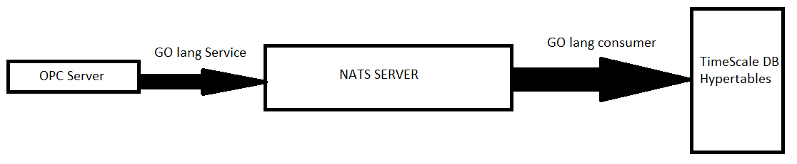

# OPC2NATS2DB

Welcome to the OPC2NATS2DB project! This repository contains a pipeline designed to streamline the process of organizing data produced by automated systems, sending it to a NATS queue, and subsequently saving it to a database.

## Prerequisites
Before starting, create a configuration file named `my_config.txt` in the main folder. Note that certain parts of the code can function with an empty or missing config file, as default values are provided. If not specified otherwise, the default values should suffice for most configurations.

## Configuration File Summary

1. OPC Server IP
2. NATS Server IP
3. NATS Subject
4. Database Server IP
5. Database Username
6. Database Password
7. Database Table Name
8. Database Connection Port
9. SSL Protocol for Database Connection
10. Consistent Read Mode (W.I.P Currently Does Nothing)

## Software Components

### `opc_server.py`

**Purpose**: Simulates an OPC server by generating and broadcasting data.

**Pre-run Adjustments**:
- Add the OPC server IP as the first line in the config file. The default port for OPC servers is 4840.
- The default OPC server IP is `localhost`.

**Execution**:
- Run the command: `python opc_server.py`.

### `golang_service.go`

**Purpose**: Transmits data from the OPC server to the NATS queue. This code is adaptable and can work with different OPC servers without modification.

**Pre-run Adjustments**:
- Add the OPC server IP as the first line in the config file. The program listens on the default port 4840.
- The default OPC server IP is `localhost`.
- Add the NATS server IP as the second line in the config file.
- The default NATS server IP is `localhost`.
- Add the NATS subject as the third line in the config file.
- The default NATS subject is `test.subject`.
- Ensure both the OPC server and NATS server are running.
- To start the NATS server, execute the `nats-server.exe` application found in the directory starting with `nats-server` and wait for it to start.

**Execution**:
- Run the command: `go run golang_service.go`.

### `golang_consumer.go`

**Purpose**: Retrieves data from the NATS queue and transfers it to a database. Currently, it reads the data and prints it to the console. Future updates will include writing to TimescaleDB.

**Pre-run Adjustments**:
- Add the NATS server IP as the second line in the config file.
- The default NATS server IP is `localhost`.
- Add the NATS subject as the third line in the config file.
- The default NATS subject is `test.subject`. Ensure it matches the subject set in the service.
- Add the database server IP as the fourth line in the config file.
- The default database server IP is `localhost`.
- Add the database administrative username as the fifth line in the config file.
- Add the database administrative password as the sixth line in the config file.
- Add the database table name as the seventh line in the config file.
- The administrative username, password, and table name must be set by the user due to privacy concerns. There are no default values for these fields.
- Add the database server port as the eighth line in the config file.
- The default port for PostgreSQL is 5432.
- Add the SSL mode as the ninth line in the config file.
- The default SSL mode is `disabled`.

**Execution**:
- Run the command: `go run golang_consumer.go`.

---

By following these instructions, you can set up and run the components of the OPC2NATS2DB project, enabling the automated processing and storage of data from OPC servers through NATS queues.